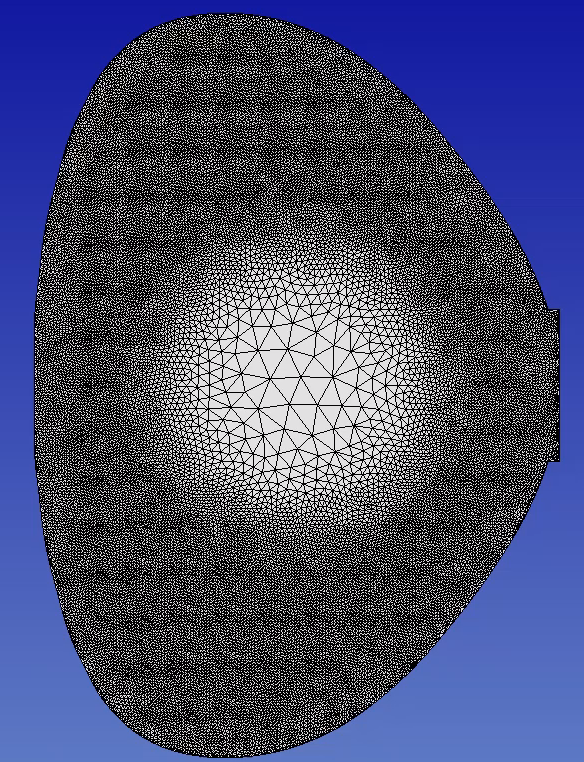

I have created some examples to demonstrate how this code can
be used.

## Example 1: Gaussian Size Distribution
To plot this, I used Gaussian distribution of mesh size centered at
the center of the geometry bounding box with the following parameters:

```
# Input in test/asset directory
input_wall = ltx_wall.dat
output = ltx_graded_gauss
gradation_rate = 0.2

# Size field: type = uniform | gaussian
size_field.type = gaussian

# For uniform size:
# size_field.uniform = 0.05

# For gaussian:
size_field.gaussian.center = calculate
size_field.gaussian.max = 0.1
size_field.gaussian.min = 0.005
size_field.gaussian.sigma = 0.05
```
and the [LTX boundary description](test/asset/ltx_wall.dat) and no gradation.
The resulting mesh size distribution looks like this:


## Example 2: Gaussian Size Distribution with Gradation
To plot this, I used similar set up as in Example 1, but with different
sizes:
```
# Input in test/asset directory
input_wall = ltx_wall.dat
output = ltx_graded_gauss
gradation_rate = 0.2

# Size field: type = uniform | gaussian
size_field.type = gaussian

# For uniform size:
# size_field.uniform = 0.05

# For gaussian:
size_field.gaussian.center = calculate
size_field.gaussian.max = 0.3
size_field.gaussian.min = 0.02
size_field.gaussian.sigma = 0.05
```
and with a gradation rate of 0.2. The resulting mesh size distribution looks like this:


