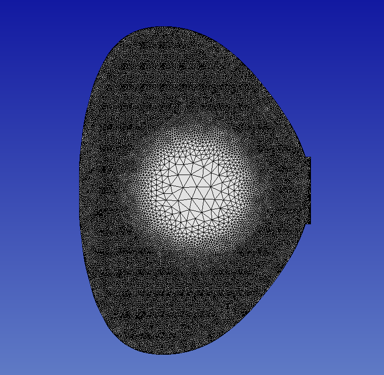
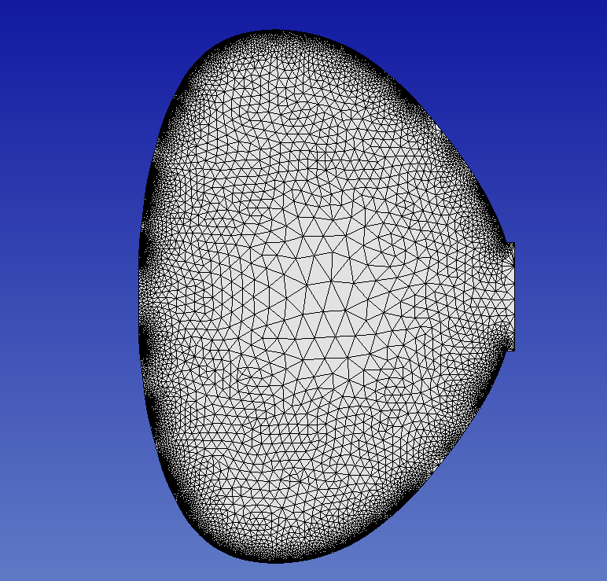

I have created some examples to demonstrate how this code can
be used.

## Example 1: Gaussian Size Distribution
To plot this, I used Gaussian distribution of mesh size centered at
the center of the geometry bounding box with the following parameters:

```
        0.1,                               // maxSize at center
        0.005,                             // minSize
        0.05                               // sigma
```
and the [LTX boundary description](test/asset/ltx_wall.dat) and no gradation.
The resulting mesh size distribution looks like this:


## Example 2: Gaussian Size Distribution with Gradation
To plot this, I used similar set up as in Example 1, but with different
sizes:
```
        0.3,                               // maxSize at center
        0.02,                             // minSize
        0.05                               // sigma
```
and with a gradation rate of 0.2. The resulting mesh size distribution looks like this:


